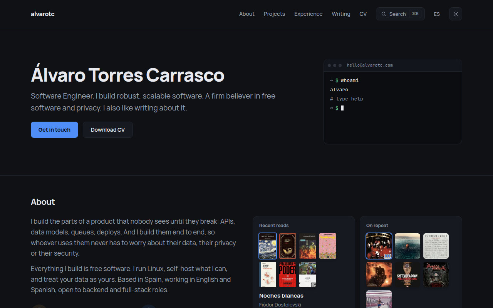
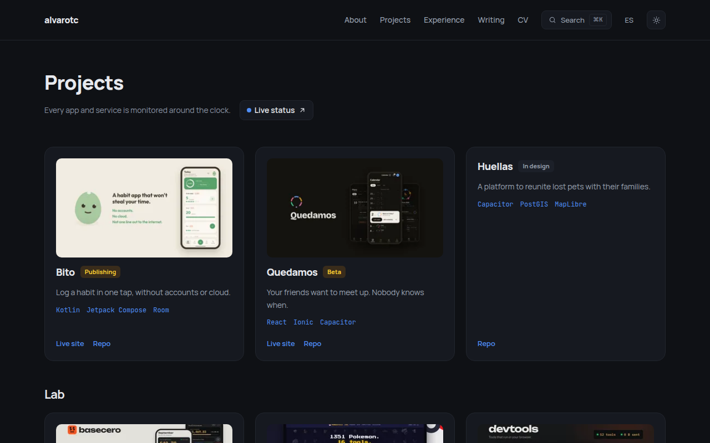
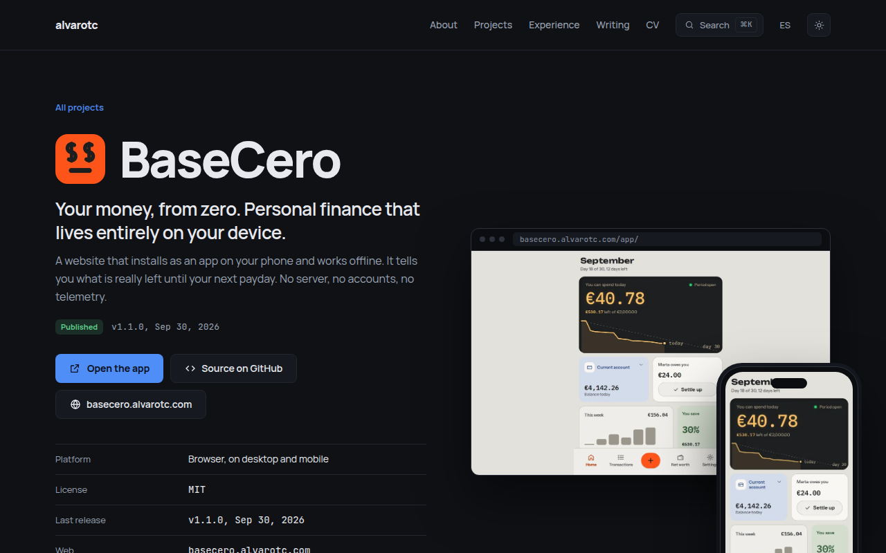
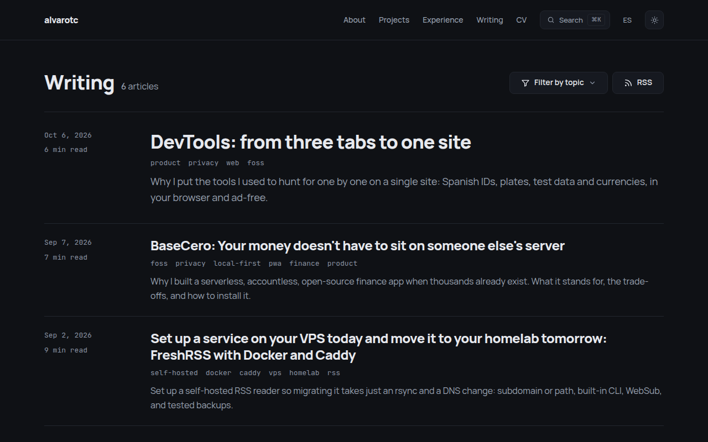
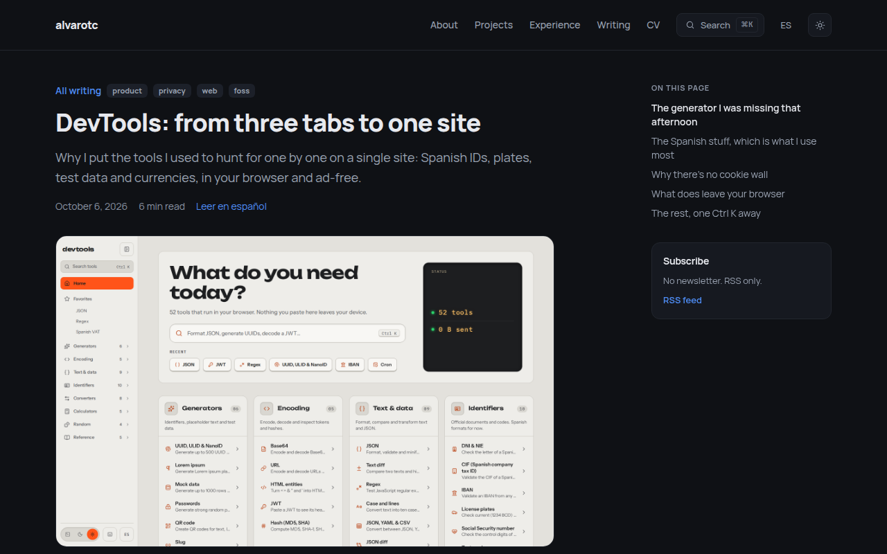
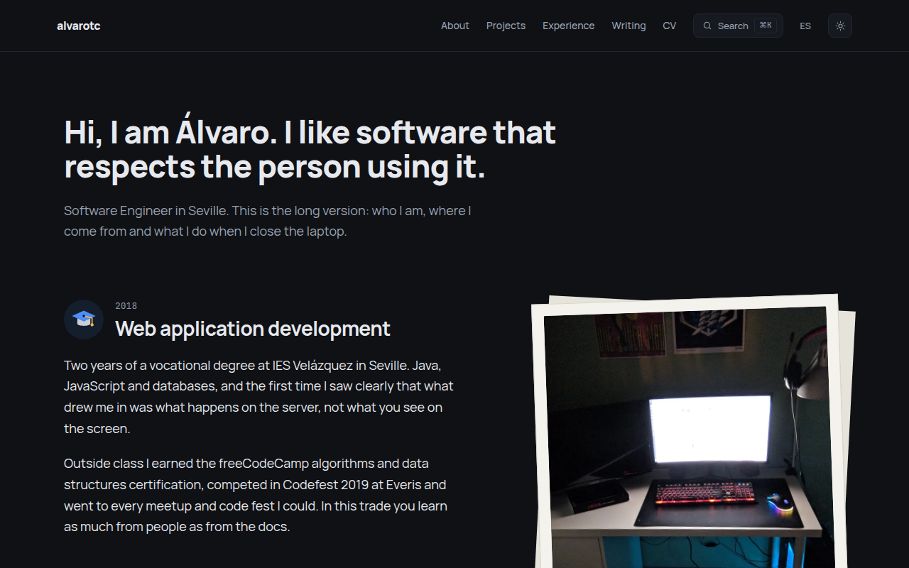
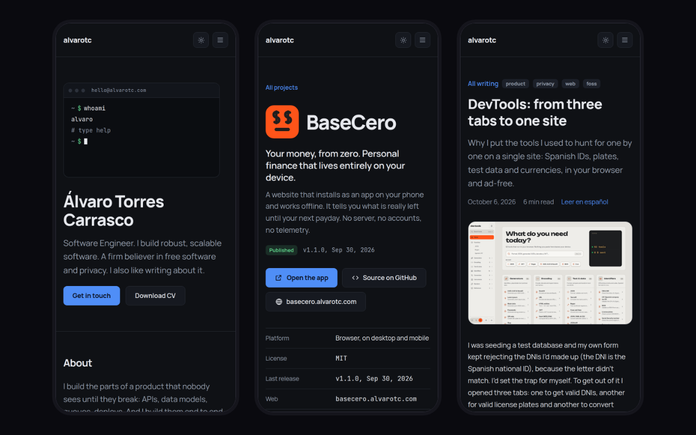

_[Español](README.md) · **English**_

# alvarotc.com

**My personal site, all of it in English and Spanish.** No cookies, no
trackers, and this repository is its source code.

## The home page

My name, what I do and a terminal that answers back: type `help` and it
lets you move around the site with `ls`, `cd` or `cat stack`. Below come the
projects, my experience, the latest articles, the stack, what I do off the
clock and a contact form.

## Projects

My projects, each with its status: featured at the top, the lab below.

- **Bito** · Log a habit in one tap, without accounts or cloud.
- **Quedamos** · Your friends want to meet up. Nobody knows when.
- **Huellas** · A platform to reunite lost pets with their families.
- **BaseCero** · Your money, from zero. Personal finance that lives entirely on your device.
- **PokeUtils** · Your retro Pokémon guide: competitive analysis, breeding and a full Pokédex.
- **DevTools** · The tools you open twenty times a day, on one site.
- **Cheesy** · Lessons, openings, endgames and tactics, in your browser.

## A project page

Every project has its own page: what it does, why it exists and how it's
built, plus screenshots and a changelog once there's a release out.
Some pages include a video of the app, and the BaseCero one lets you try the
whole app without leaving the page.

## Writing

I write about software engineering, self-hosting and privacy. You can
filter by topic and follow along by RSS, with one feed per language.

## An article

Every post has a table of contents, a link to the other language and its
own image for sharing.

## About

The long version: where I come from, where I've worked, what I care about
and what I do when I close the laptop, with photos from each stage.

## On a phone

## Author

Made by [Álvaro Torres Carrasco](https://github.com/alvarotorresc). Live at
[alvarotc.com](https://alvarotc.com).

The code is released under the [MIT](./LICENSE) license. The texts, images
and articles are mine, all rights reserved unless stated otherwise.
