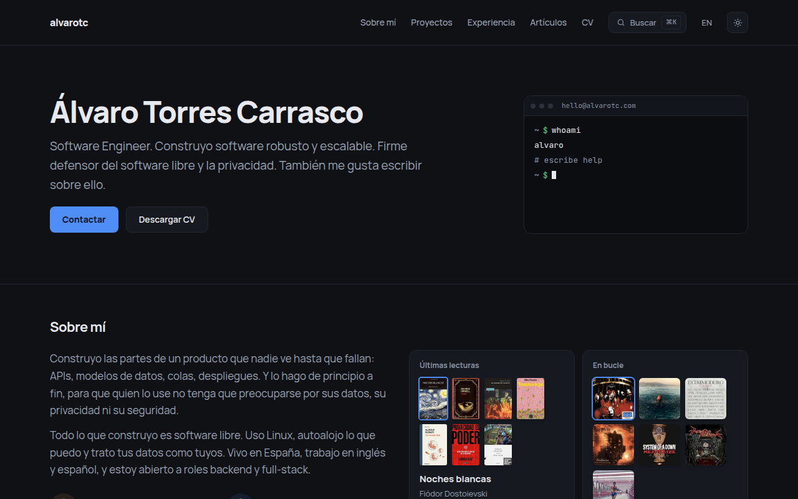
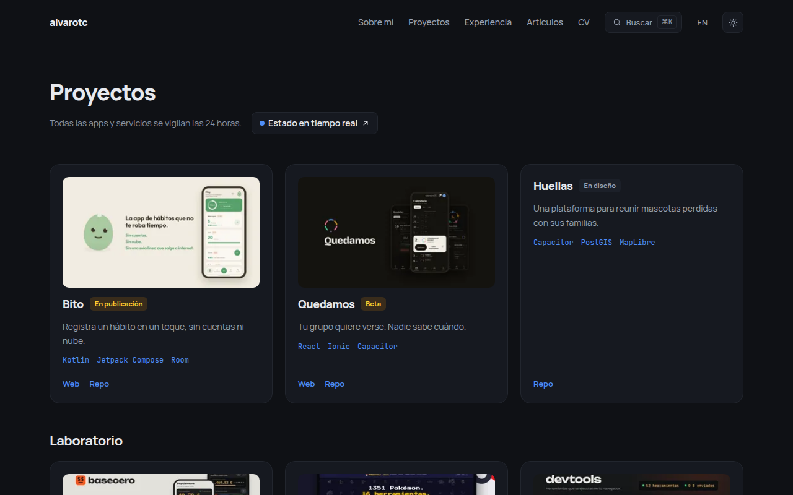
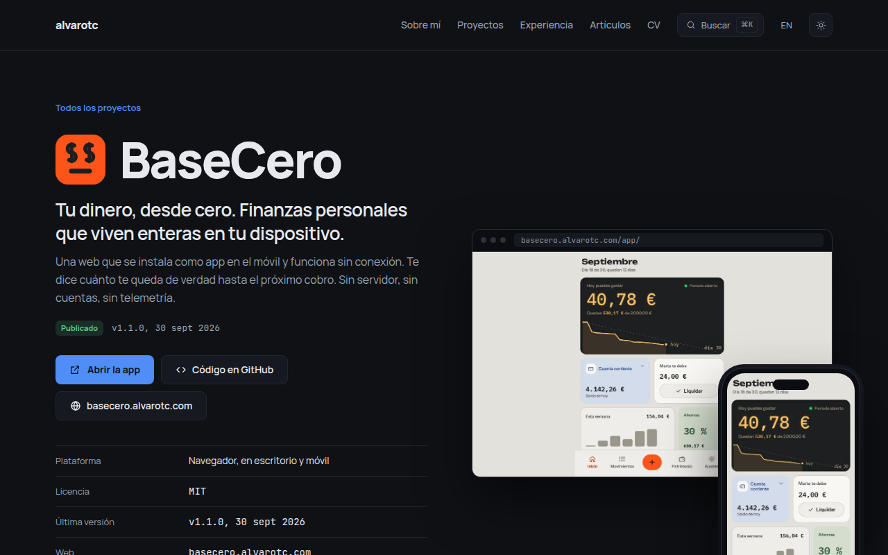
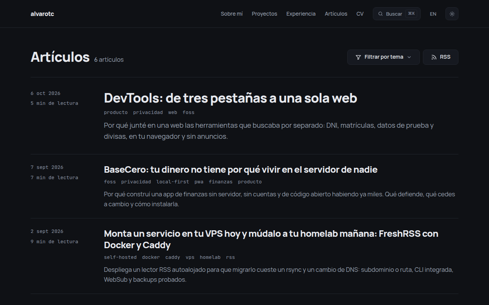
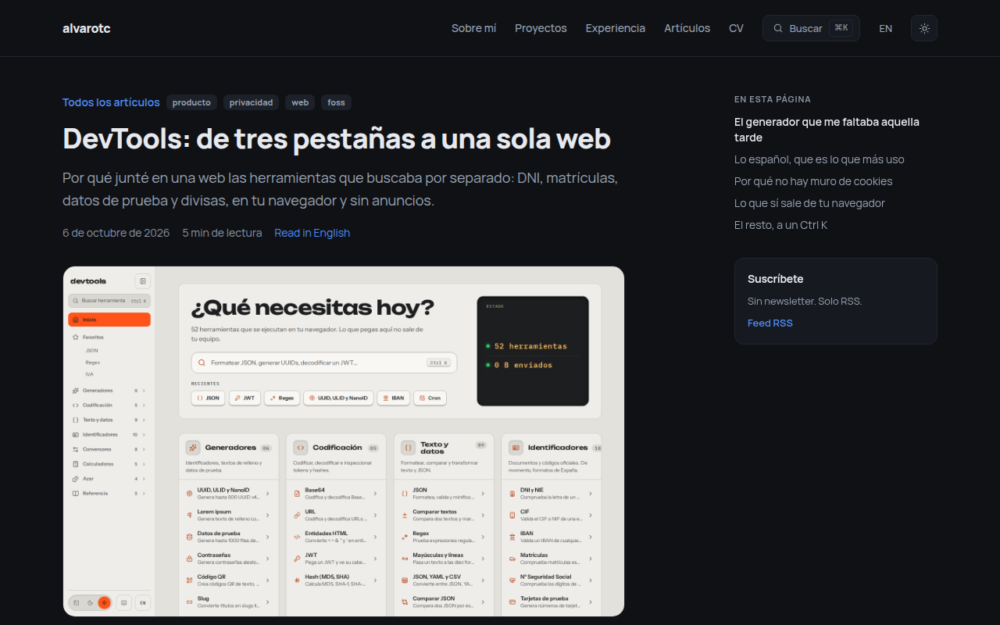
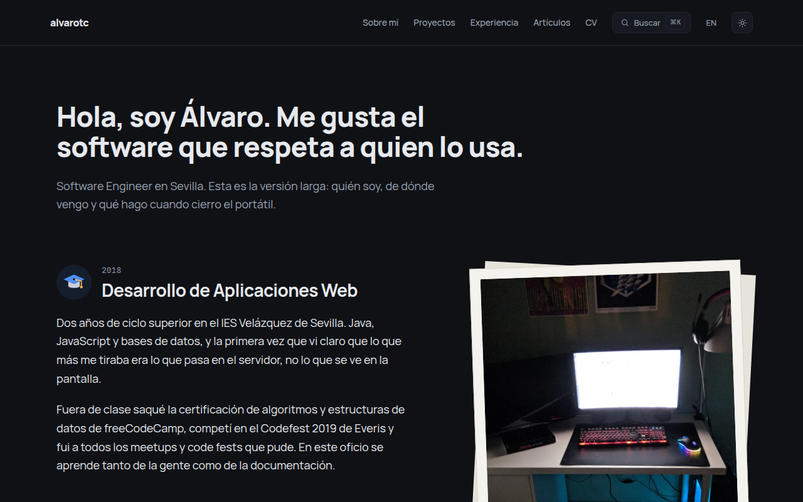
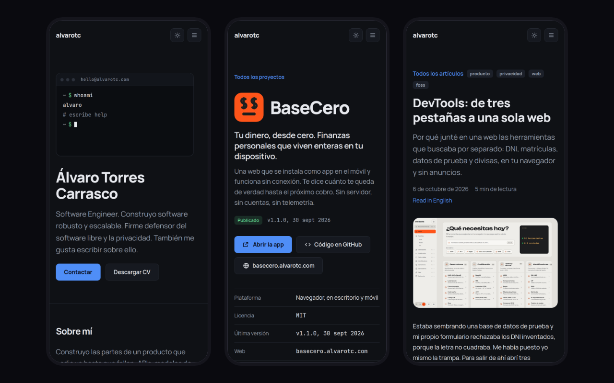

_**Español** · [English](README.en.md)_

# alvarotc.com

**Mi web personal, entera en español y en inglés.** Sin cookies ni
rastreadores, y su código es este repositorio.

## La portada

Mi nombre, a qué me dedico y una terminal que responde: escribe `help` y te
deja moverte por la web con `ls`, `cd` o `cat stack`. Debajo van los
proyectos, la experiencia, los últimos artículos, el stack, lo que hago
fuera del teclado y un formulario de contacto.

## Proyectos

Mis proyectos, cada uno con su estado: arriba los destacados, debajo
el laboratorio.

- **Bito** · Registra un hábito en un toque, sin cuentas ni nube.
- **Quedamos** · Tu grupo quiere verse. Nadie sabe cuándo.
- **Huellas** · Una plataforma para reunir mascotas perdidas con sus familias.
- **BaseCero** · Tu dinero, desde cero. Finanzas personales que viven enteras en tu dispositivo.
- **PokeUtils** · Tu guía Pokémon retro: análisis competitivo, crianza y Pokédex completa.
- **DevTools** · Las herramientas que abres veinte veces al día, en una sola web.
- **Cheesy** · Lecciones, aperturas, finales y táctica, en tu navegador.

## Una ficha de proyecto

Cada proyecto tiene su página: qué hace, por qué existe y cómo está hecho,
con capturas y su historial de cambios cuando ya hay versión publicada.
Algunas fichas traen un vídeo de la app, y la de BaseCero te deja probarla
entera sin salir de la página.

## Artículos

Escribo sobre ingeniería de software, self-hosting y privacidad. Se pueden
filtrar por tema y seguir por RSS, un feed por idioma.

## Un artículo

Cada post tiene índice, enlace a la otra versión de idioma y su propia
imagen para compartir.

## Sobre mí

La versión larga: de dónde vengo, dónde he trabajado, lo que me importa y lo
que hago cuando cierro el portátil, con fotos de cada etapa.

## En el móvil

## Autor

Hecha por [Álvaro Torres Carrasco](https://github.com/alvarotorresc). Está en
[alvarotc.com](https://alvarotc.com).

El código se publica con licencia [MIT](./LICENSE). Los textos, las imágenes
y los artículos son míos, con todos los derechos reservados salvo que se
indique otra cosa.
