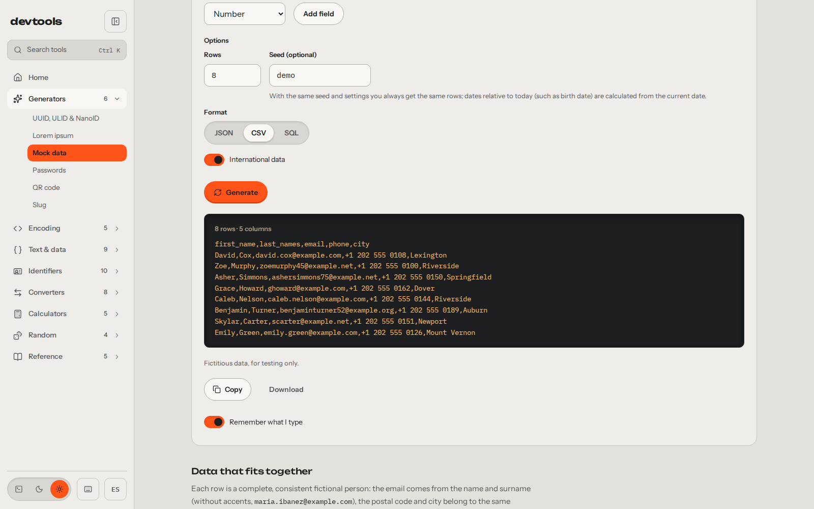
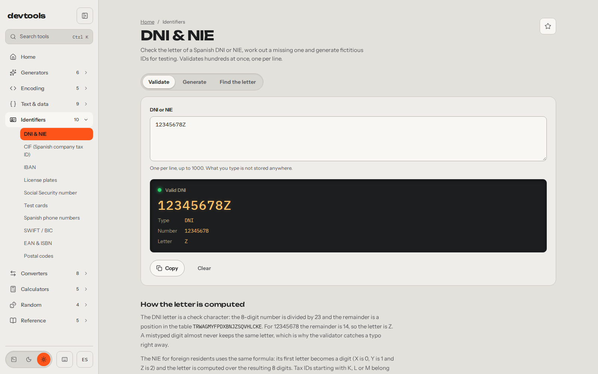
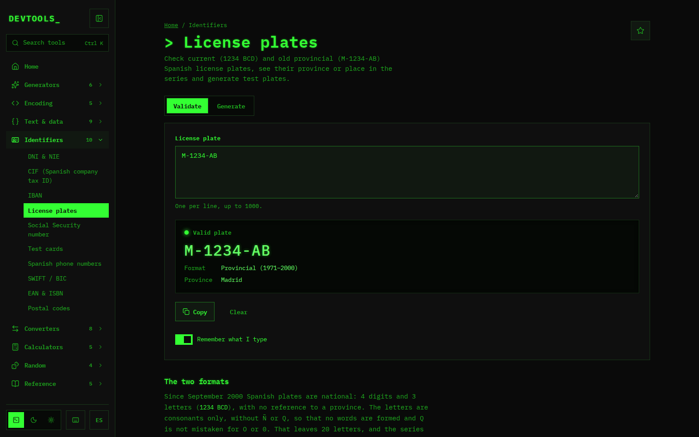
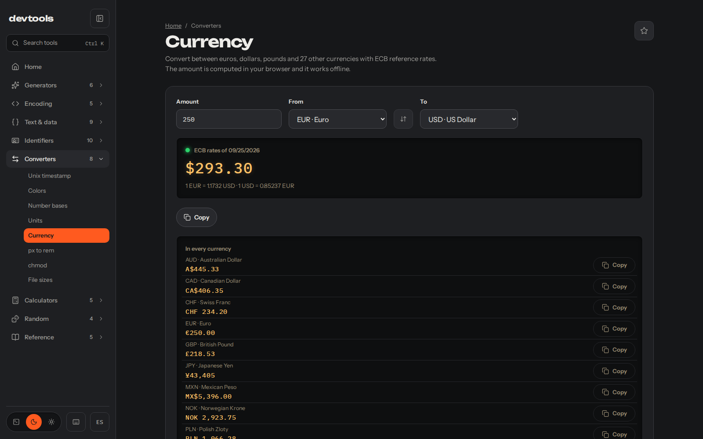

I was seeding a test database and my own form kept rejecting the DNIs I'd made up (the DNI is the Spanish national ID), because the letter didn't match. I'd set the trap for myself. To get out of it I opened three tabs: one to get valid DNIs, another for valid license plates and another to convert currencies. Each one had its cookie wall and an ad or two on top of the result. One site per tool, and as many tabs as things I needed.

So I built myself a site with the tools I used. The first version went out on 14 February 2026 with 14 tools, the same day as the first commit. On 26 September I rebuilt it from scratch in Astro and Svelte, with themes and in Spanish and English, and today there are 52 in eight categories: [devtools.alvarotc.com](https://devtools.alvarotc.com/en).

It wasn't just that afternoon. Developing, putting together mockups, running tests against a database or sorting out some piece of paperwork, I always ended up jumping between sites that asked me to accept cookies before giving me the result. That's why the site has to solve your problem first, and not charging you anything for it comes as standard, because of how it's built.

## The generator I was missing that afternoon

What I needed that day is now the [mock data generator](https://devtools.alvarotc.com/en/mock-data-generator). It produces up to a thousand rows of fictitious people with names, emails, DNIs and IBANs, in JSON, CSV or SQL. The rows hold together: the email comes from that person's name and surnames, and the letter of each DNI is calculated correctly. They pass the validation that kept rejecting my made-up ones on the first try.

It also has a seed. With the same seed and the same settings you always get the same rows, so a test that fails today fails the same way tomorrow and I can seed the database again with the same rows. There's one catch, and the tool itself warns you about it under the field: dates relative to today, like the birth date, are calculated from the day you generate them.

## The Spanish stuff, which is what I use most

What I use most is the Spanish stuff. There's [DNI and NIE](https://devtools.alvarotc.com/en/spanish-dni-nie-validator) (the NIE is the ID for foreign residents), CIF (the company tax ID), IBAN, [license plates](https://devtools.alvarotc.com/en/spanish-license-plate-validator), Social Security number, phone numbers and postal codes. For paperwork there's VAT, IRPF withholding (Spanish income tax taken from each payment) and working days with the national holidays.

The DNI one validates, works out the missing letter and generates fictitious documents for testing. It takes one per line, up to a thousand at once. The letter is a check character: the remainder of dividing the number by 23 gives its position in a table of letters. That's why a DNI made up by hand almost never matches.

The license plate one follows the same idea: it checks current plates (1234 BCD) and the old provincial ones (M-1234-AB), tells you the province or the position in the series and generates test plates. The screenshot is in the terminal theme, green phosphor on black, one of the three the site has along with light and dark.

## Why there's no cookie wall

Everything runs in your browser. There's no backend: the site is static files, and what you paste into a tool doesn't leave your machine. I did it this way because I didn't trust those sites not to keep what I pasted into them, and whatever gets stored can leak. Here there's no backend to receive it.

With anything that could be personal I go one step further. DNIs, IBANs, Social Security numbers, phone numbers, cards, JWTs, cURL commands, passwords and hashes are never stored, not even in your own browser. JSON or a regex do get remembered when you come back, because it's handy to find them where you left them, and you can turn that off in each tool with the "Remember what I type" switch.

It has a small cost, and I accept it on purpose: the DNI you validated yesterday isn't there when you come back, and you have to paste it again. There's no account, no cookie banner and no ads.

## What does leave your browser

Two things leave it, and I'd rather say so myself. The first is a visit counter: Umami, on my own server. The second is the download of the ECB (European Central Bank) reference exchange rates for the [currency converter](https://devtools.alvarotc.com/en/currency-converter). It doesn't ask the ECB directly but `api.frankfurter.dev`, a service that publishes that table, in a single request with no parameters, and it keeps the latest table so it works offline. The exact sentence is this: what you paste doesn't leave your browser, but the visit and the request for the table do.

The converter is the third tab from that afternoon. It converts between euros, dollars, pounds and 27 other currencies, and the amount is calculated in your browser with the table it has already downloaded.

## The rest, one Ctrl K away

Besides what I've covered there's the JSON formatter, the JWT decoder, cron, regex and the rest up to 52. You don't need to go through the menu: press `Ctrl K` on any page, type what you're looking for ("cron", "base64") and it's right there. The project page is at [/projects/devtools](/projects/devtools/).

The site is at [devtools.alvarotc.com](https://devtools.alvarotc.com/en) and the code, under the MIT license, at [github.com/alvarotorresc/devtools](https://github.com/alvarotorresc/devtools). If you miss a tool or one of them breaks, the place to say so is the repository: that's where I read it and that's where I reply, in the open.
