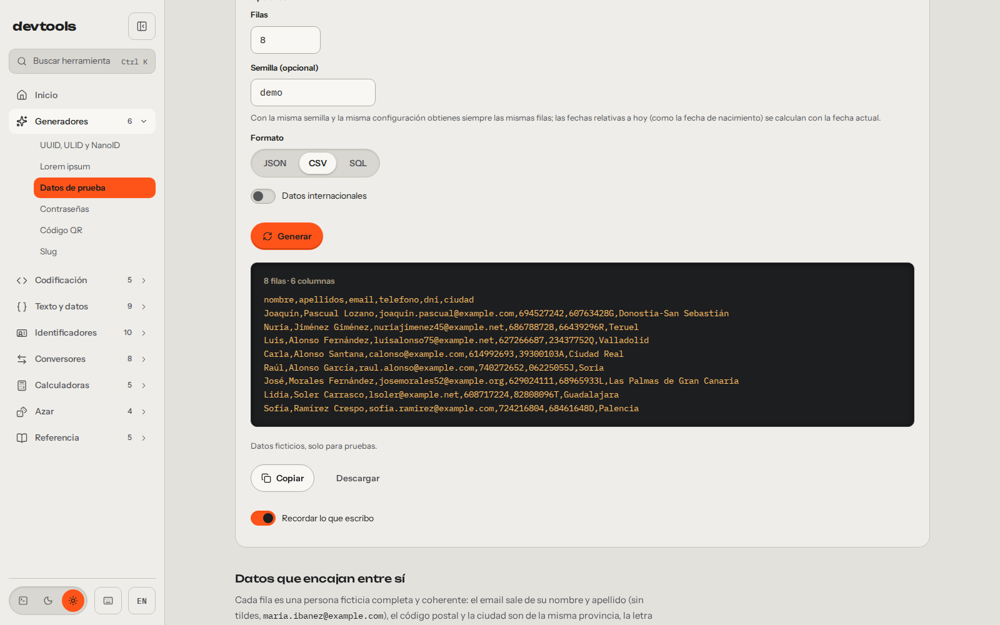
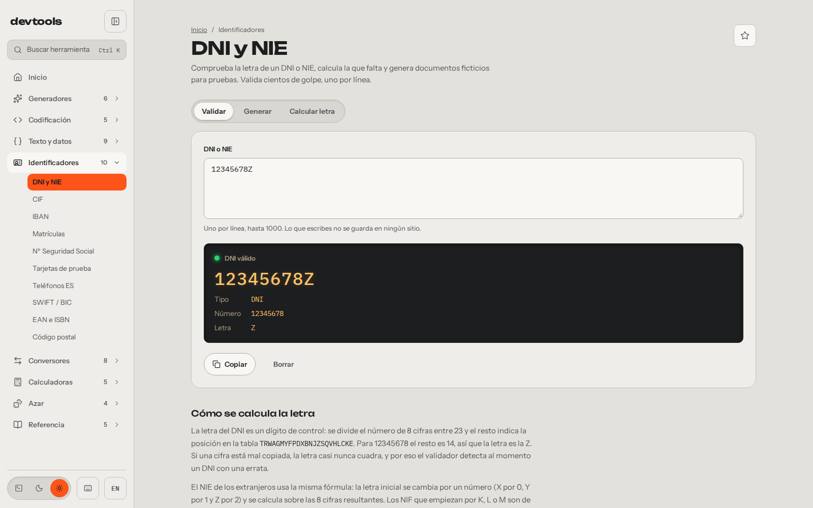
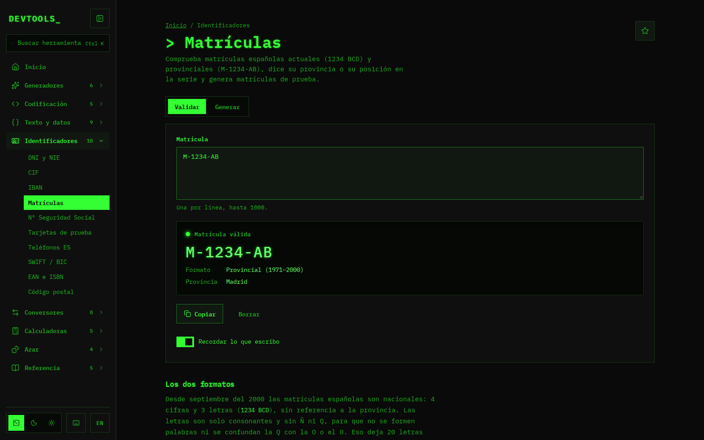
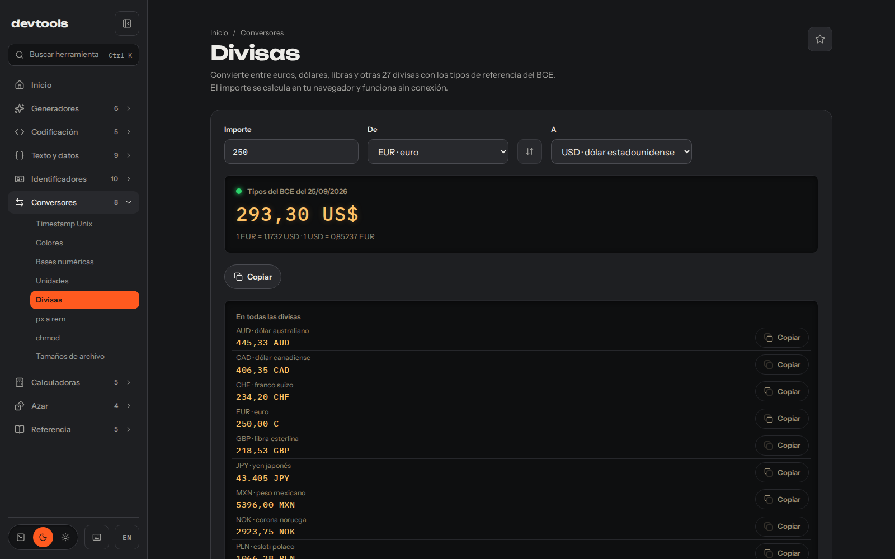

Estaba sembrando una base de datos de prueba y mi propio formulario rechazaba los DNI inventados, porque la letra no cuadraba. Me había puesto yo mismo la trampa. Para salir de ahí abrí tres pestañas: una para sacar DNI válidos, otra para matrículas válidas y otra para convertir monedas. Cada una con su muro de cookies y algún anuncio encima del resultado. Una web por herramienta, y tantas pestañas como cosas necesitaba.

Así que me hice una web con las herramientas que usaba. La primera versión salió el 14 de febrero de 2026 con 14 herramientas, el mismo día del primer commit. El 26 de septiembre la rehice entera en Astro y Svelte, con temas y en español e inglés, y hoy son 52 en ocho categorías: [devtools.alvarotc.com](https://devtools.alvarotc.com/es).

No era solo esa tarde. Desarrollando, montando mockups, haciendo pruebas en base de datos o resolviendo alguna gestión burocrática, acababa siempre saltando entre webs que antes de darme el resultado me pedían aceptar cookies. Por eso la web primero tiene que resolverte el problema, y que no te cobre nada por ello viene de serie, por cómo está hecha.

## El generador que me faltaba aquella tarde

Lo que necesitaba ese día es hoy el [generador de datos de prueba](https://devtools.alvarotc.com/es/generador-datos-de-prueba). Saca hasta mil filas de personas ficticias con nombres, emails, DNI e IBAN, en JSON, CSV o SQL. Las filas son coherentes entre sí: el email sale del nombre y los apellidos de esa persona, y la letra de cada DNI está bien calculada. Pasan a la primera la validación que me tumbaba los inventados.

Además tiene semilla. Con la misma semilla y la misma configuración salen siempre las mismas filas, así que un test que falla hoy falla igual mañana y puedo volver a sembrar la base de datos con las mismas filas. Hay un matiz, y la propia herramienta lo avisa debajo del campo: las fechas relativas a hoy, como la de nacimiento, se calculan con la fecha del día en que generas.

## Lo español, que es lo que más uso

Lo que más uso es lo español. Están [DNI y NIE](https://devtools.alvarotc.com/es/validador-dni-nie), CIF, IBAN, [matrículas](https://devtools.alvarotc.com/es/validador-matriculas), número de la Seguridad Social, teléfonos y códigos postales. Para las gestiones están el IVA, la retención de IRPF y los días hábiles con los festivos nacionales.

La de DNI valida, calcula la letra que falta y genera documentos ficticios para pruebas. Acepta uno por línea, hasta mil de golpe. La letra es un dígito de control: el resto de dividir el número entre 23 marca su posición en una tabla de letras. Por eso un DNI inventado a mano casi nunca cuadra.

La de matrículas sigue la misma idea: comprueba las actuales (1234 BCD) y las provinciales (M-1234-AB), te dice la provincia o la posición en la serie y genera matrículas de prueba. La captura está en el tema terminal, fósforo verde sobre negro, uno de los tres que tiene la web junto al claro y al oscuro.

## Por qué no hay muro de cookies

Todo corre en tu navegador. No hay backend: la web son ficheros estáticos, y lo que pegas en una herramienta no sale de tu equipo. Lo hice así porque no me fiaba de que aquellas webs no guardaran lo que les pegaba, y lo que se guarda se puede filtrar. Aquí no hay backend que lo reciba.

Con lo que puede ser personal voy un paso más allá. DNI, IBAN, NSS, teléfonos, tarjetas, JWT, cURL, contraseñas y hashes no se guardan nunca, ni siquiera en tu propio navegador. El JSON o la regex sí se recuerdan al volver, porque es cómodo encontrarlos donde los dejaste, y eso se desactiva en cada herramienta con el interruptor «Recordar lo que escribo».

Tiene un coste pequeño, y lo asumo a propósito: el DNI que validaste ayer no está cuando vuelves, y toca pegarlo otra vez. No hay cuenta, ni banner de cookies, ni anuncios.

## Lo que sí sale de tu navegador

Salen dos cosas, y prefiero decirlo yo. La primera es un contador de visitas: Umami, en mi propio servidor. La segunda es la descarga de los tipos de cambio de referencia del BCE para el [conversor de divisas](https://devtools.alvarotc.com/es/conversor-divisas), que guarda la última tabla para funcionar sin conexión. La frase exacta es esta: lo que pegas no sale de tu navegador, pero la visita y la petición de la tabla del BCE sí.

El conversor es la tercera pestaña de aquella tarde. Pasa entre euros, dólares, libras y otras 27 divisas, y el importe se calcula en tu navegador con la tabla que ya tiene descargada.

## El resto, a un Ctrl K

Además de lo contado están el formateador de JSON, el decodificador de JWT, el cron, la regex y el resto hasta 52. No hace falta recorrer el menú: pulsas `Ctrl K` en cualquier página, escribes lo que buscas («iva», «cron», «base64») y la tienes delante. La ficha del proyecto está en [/projects/devtools](/es/projects/devtools/).

La web está en [devtools.alvarotc.com](https://devtools.alvarotc.com/es) y el código, con licencia MIT, en [github.com/alvarotorresc/devtools](https://github.com/alvarotorresc/devtools). Si echas en falta una herramienta o alguna falla, el sitio para decirlo es el repositorio: ahí lo leo y ahí contesto, en abierto.
